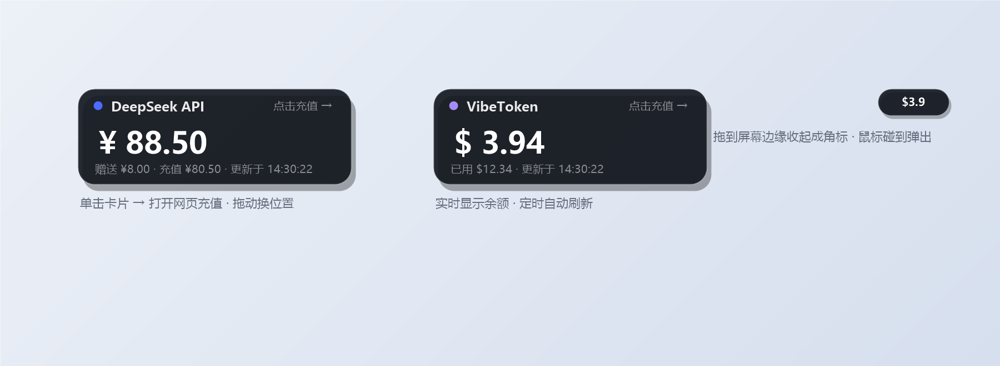

# API 余额桌面挂件（透明悬浮卡片）

> 把 **DeepSeek / VibeToken** 等 API 账户的余额常驻显示在桌面的透明小卡片上，
> 单击直达充值页；拖到屏幕边缘自动收起成"悬浮球"角标——像手机 App 一样贴边收纳，鼠标碰到就弹出。

**零依赖**：不需要安装任何东西，Windows 10/11 自带 PowerShell 即可运行。

## 功能特性

- 🪟 半透明磨砂小卡片，桌面置顶常驻，随时瞥一眼就知道余额
- 🖱️ **单击卡片**直接打开对应网页（充值 / 用量页）
- 📌 **拖到屏幕边缘**自动收起成小角标（悬浮球），角标上实时显示余额；鼠标碰到弹出、移开立即收回
- 🔄 定时自动刷新（默认 5 分钟，可配置）
- 📋 右键菜单：刷新余额 / 复制余额 / 打开网页 / 贴边收起 / 开机自启 / 编辑配置 / 退出
- 🚀 **开机自启**，静默启动（无任何终端窗口弹出）
- 🔌 支持任意返回 JSON 的余额接口（自定义字段路径解析），可适配其他 API 平台
- 🪶 纯 PowerShell + WPF 实现，无第三方依赖

## 效果预览



> 图为界面示意图（余额为演示数值）。左：DeepSeek 卡片（展开状态）；右：VibeToken 角标（贴边收起状态）。

## 快速开始

1. 到 **Releases** 页面下载最新 `api-balance-widget-vX.X.X.zip`，解压到任意目录（或直接克隆本仓库）；
2. 编辑 `config.json`（首次运行会自动生成模板；字段说明见 `config.example.json`）：
   - **DeepSeek**：打开 <https://platform.deepseek.com/api_keys> 创建 API Key（`sk-` 开头），填入 `deepseek.token`；
   - **VibeToken**：登录后在网站「API Keys」页面创建密钥，填入 `vibetoken.token`；
3. 双击 **`start-all.vbs`** 启动两个挂件（无任何窗口弹出）。

### 开机自启

双击 **`开机自启设置.bat`** 一键开启/关闭；或在挂件上右键 → 勾选/取消「开机自启」。
开启后每次开机自动启动挂件，全程无终端窗口。

## 配置说明

`config.json` 中每个平台各一份配置（本仓库内置 DeepSeek 与 VibeToken 示例）：

| 字段 | 说明 | DeepSeek 示例 | VibeToken 示例 |
|---|---|---|---|
| `title` | 卡片标题 | `DeepSeek API` | `VibeToken` |
| `openUrl` | 单击卡片打开的网页 | `https://platform.deepseek.com/usage` | `https://vibetoken.top/dashboard` |
| `apiUrl` | 余额查询接口 | `https://api.deepseek.com/user/balance` | `https://vibetoken.top/v1/usage` |
| `auth` | 认证方式：`bearer`（密钥）或 `cookie` | `bearer` | `bearer` |
| `token` | API 密钥 / Cookie | `sk-...` | `sk-...` |
| `mode` | 解析模式：`newapi`（new-api 系）或 `jsonpath`（自定义字段） | `newapi` | `jsonpath` |
| `jsonPath` | 余额字段路径（点分） | — | `balance` |
| `extraPath` | 已用金额字段路径（可选） | — | `usage.total.actual_cost` |
| `divisor` | 数值换算除数（如 1 或 500000） | — | `1` |
| `currency` | 货币符号 | — | `$` |
| `refreshSeconds` | 刷新间隔（秒） | `300` | `300` |
| `accent` | 卡片左上角小圆点颜色 | `#4D6BFE` | `#A78BFA` |
| `x` / `y` | 初始位置 | `60, 60` | `330, 60` |
| `docked` / `dockEdge` | 贴边状态记忆（自动维护） | `false` / `left` | `false` / `left` |

> 支持任意 JSON 余额接口：把接口 URL、认证方式和字段路径填进配置即可，
> 无需改代码。接口不通时可用 `probe-vibetoken.bat` 探测站点接口（提交 Issue 时附上探测输出很有帮助）。

## 常见问题

| 现象 | 处理 |
|---|---|
| 显示「未配置 Token」 | 按快速开始填写 `config.json`，右键挂件 → 刷新余额 |
| 显示「密钥/登录已失效」 | Token 过期：DeepSeek 重新创建 Key；VibeToken 去网站重新生成 |
| 显示「获取失败」 | 网络问题，挂件每 5 分钟自动重试 |
| 余额数字与网页不符 | 检查/校准 `jsonPath`、`divisor`、`currency` 字段 |
| 想改刷新频率/颜色/位置 | 编辑 `config.json` 对应字段 |
| 挂件异常 | 查看同目录下 `widget-error.log`，提交 Issue 时一并附上 |

## 安全提醒

`config.json` 中保存的是明文密钥，**不要**把该文件提交到仓库、发给别人或传到网盘。
本仓库的 `.gitignore` 已忽略 `config.json`，请保持该规则。

## 项目结构

```
balance-widget.ps1        挂件主程序（PowerShell + WPF）
start-all.vbs             一键启动两个挂件（静默）
start-deepseek.vbs / start-vibetoken.vbs   单个挂件静默启动器
start-all.bat / start-*.bat                同功能的 bat 入口
开机自启设置.bat / toggle-autostart.ps1    开机自启开关
probe-vibetoken.ps1 / .bat                 站点接口探测工具
config.example.json        配置模板（不含密钥）
build-release.ps1          本地打包脚本（生成 dist/*.zip）
.github/workflows/release.yml  推 v* 标签自动构建 Release
screenshots/               效果预览图
```

## 开发与调试

- 冒烟测试（自动显示 5 秒后关闭，不写配置）：`powershell -NoProfile -ExecutionPolicy Bypass -File balance-widget.ps1 -Site deepseek -SmokeTest`
- 本地打包：`powershell -File build-release.ps1`，产物在 `dist/`
- 发布 Release：推送 `v1.0.0` 格式的标签即可触发 GitHub Actions 自动打包

## 许可证

[MIT](LICENSE)
